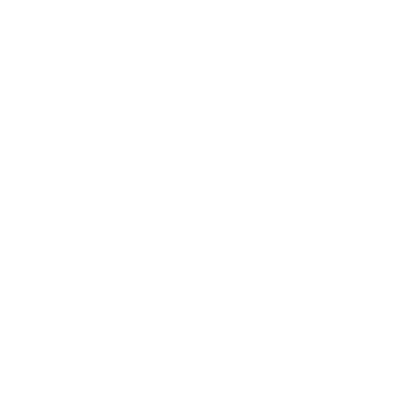

<a name="readme-top"></a>

<div align="center">

  
  <br/>

### CoinStatus App
<b>CoinStatus App</b> is the MVP of a [SPA](https://en.wikipedia.org/wiki/Single-page_application) application that lets users to:<br>1) See a list of current Cryptocurrencies,<br>2) Click on any of the items showed in the list,<br>3) See the details of the Cryptocurrency selected.

<sup>It uses an API to retrieve real Cryptocurrency data.</sup>

</div>

# 📗 Table of Contents

- [📗 Table of Contents](#-table-of-contents)
- [🪙 CoinStatus App](#about-project)
    - [Preview CoinStatus App](#preview-of-coinstatus-app)
  - [🛠 Built With ](#-built-with-)
    - [Tech Stack ](#tech-stack-)
    - [Key Features ](#key-features-)
  - [💻 Getting Started ](#-getting-started-)
    - [Prerequisites](#prerequisites)
    - [Available Scripts](#available-scripts)
  - [👥 Authors ](#-authors-)
  - [🔭 Future Features ](#-future-features-)
  - [🤝 Contributing ](#-contributing-)
  - [🙏 Acknowledgments ](#-acknowledgments-)
  - [⭐ Show your support ](#-show-your-support-)
  - [📝 License ](#-license-)

<div align="center"><hr width="250px"/></div>

# 🪙 CoinStatus App <a name="about-project"></a>

*CoinStatus App* is the MVP of a [SPA](https://en.wikipedia.org/wiki/Single-page_application) application that lets users to see a list of Cryptocurrencies, select one of them, see its details.

<sup>This is a Capstone project and it was built in order to complete the <b>React</b> and <b>Redux</b> module.</sup>

<div align="center">

### Preview of CoinStatus App.

<p>
  <br>
  <sup>The app will have these styles but with different content.</sup><br>
</p>

</div>

<p align="right">(<a href="#readme-top">back to top</a>)</p>

## 🛠 Built With <a name="built-with"></a>
### Tech Stack <a name="tech-stack"></a>
This project was bootstrapped with:
  <ul>
    <li>
      <a href="https://react.dev/" target="_blank" rel="noopener noreferrer">
       React</a>
    </li>
    <li>
      <a href="https://create-react-app.dev/" target="_blank" rel="noopener noreferrer">
       Create React App</a>
    </li>
    <li>
      <a href="https://redux-toolkit.js.org/" target="_blank" rel="noopener noreferrer">
       Redux Toolkit</a>
    </li>
  </ul>


### Key Features <a name="key-features"></a>

- *Display a list of Cryptocurrencies.*
- *Select a Cryptocurrency.*
- *Get the details of the Cryptocurrency selected.*

<p align="right">(<a href="#readme-top">back to top</a>)</p>
<!--
## 🚀 Live Demo <a name="live-demo"></a>

- <a href="https://luigirazum.github.io/mv-coin-status/" target="_blank" rel="noopener noreferrer">CoinStatus App</a>


<p align="right">(<a href="#readme-top">back to top</a>)</p>
-->

## 💻 Getting Started <a name="getting-started"></a>

To get a local copy of this project up and running, follow these steps.

- ### Prerequisites

   - In order to run this project locally you need `git` installed. Please got to [Getting Started - Installing Git guide](https://git-scm.com/book/en/v2/Getting-Started-Installing-Git) and follow the steps described for your system to install `git`.

   - You must have Node installed on our machine to access the NPM (Node Package Manager) tool.
   Run `node -v` and `npm -v` in the terminal to see if you have node and npm installed, respectively. Ensure you have node>=14.0.0 and npm>=5.6\
   If you don’t have them installed, head to [Node](https://nodejs.org/) to download and install the latest stable version.


- ### Setup
    Clone this repository to your desired folder:
    ```sh
    cd my-folder
    git clone git@github.com:luigirazum/mv-coin-status.git
    ```
- ### Install
    Install the package dependencies for this project with:
    ```sh
    cd mv-coin-status
    npm install
    ```


### Available Scripts
- #### Run
    In the project directory, you can run:

    ```sh
    npm start
    ```

  - Runs the app in the development mode.
    - Open [http://localhost:3000](http://localhost:3000) to view it in your browser.
  - The page will reload when you make changes.
  - You may also see any lint errors in the console.

- #### Test
    ```sh
    npm test
    ```

   - Launches the test runner in the interactive watch mode.\
    See the section about [running tests](https://facebook.github.io/create-react-app/docs/running-tests) for more information.

- #### Build
    ```sh
    npm run build
    ```

  - Builds the app for production to the `build` folder.
    - It correctly bundles React in production mode and optimizes the build for the best performance.
  - The build is minified and the filenames include the hashes.
  - Your app is ready to be deployed!\
    See the section about [deployment](https://facebook.github.io/create-react-app/docs/deployment) for more information.

- #### Deploy
    ```sh
    npm deploy
    ```

  - Deploys the project using `gh-pages`.
    - Under the hood, it runs `npm run build` first.
    - The project then is published using github pages.


<p align="right">(<a href="#readme-top">back to top</a>)</p>


## 👥 Authors <a name="authors"></a>

👨‍💻 **Luis Zubia**

- GitHub: <a href="https://github.com/luigirazum" target="_blank" rel="noopener noreferrer">**@luigirazum**</a>
- Twitter: <a href="https://twitter.com/LuigiRazum" target="_blank" rel="noopener noreferrer">**@LuigiRazum**</a>
- LinkedIn: <a href="https://linkedin.com/in/luiszubia" target="_blank" rel="noopener noreferrer">**Luis Zubia**</a>

<p align="right">(<a href="#readme-top">back to top</a>)</p>


## 🔭 Future Features <a name="future-features"></a>

- [ ] *Store app settings using localStorage.*
- [ ] *Set favorite Cryptocurrencies.*


<p align="right">(<a href="#readme-top">back to top</a>)</p>


## 🤝 Contributing <a name="contributing"></a>

In order to improve this project, contributions, issues, and feature requests are welcome!

Feel free to check the [issues page](../../issues/).


<p align="right">(<a href="#readme-top">back to top</a>)</p>


## 🙏 Acknowledgments <a name="acknowledgments"></a>
- 👏 I would like to thank the support of my partners.
- 👏 Also thanks to [**Nelson Sakwa**](http://sakwadesign.com/) whose [**design guidelines**](https://www.behance.net/gallery/31579789/Ballhead-App-(Free-PSDs)) where used to style this project and they are available under the [Creative Commons license](https://creativecommons.org/licenses/by-nc/4.0/) that requires us to give appropriate credit to the author.

<p align="right">(<a href="#readme-top">back to top</a>)</p>


## ⭐ Show your support <a name="support"></a>

I really enjoyed making this project, so, if you like it, I appreciate your support giving a ⭐.


<p align="right">(<a href="#readme-top">back to top</a>)</p>

<!--
## ❓ FAQ <a name="faq"></a>

- *Why should you use this project?*

  - Because you can realize what you can achieve using this amazing tool.

- *Why did I make this project?*

  - In order to start putting in practice the use of WebPack, JS ES6 modules and API's.


<p align="right">(<a href="#readme-top">back to top</a>)</p>
-->

## 📝 License <a name="license"></a>

This project is [MIT](./LICENSE) licensed.

<p align="right">(<a href="#readme-top">back to top</a>)</p>
